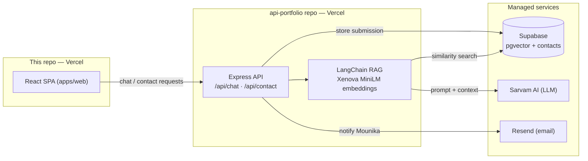
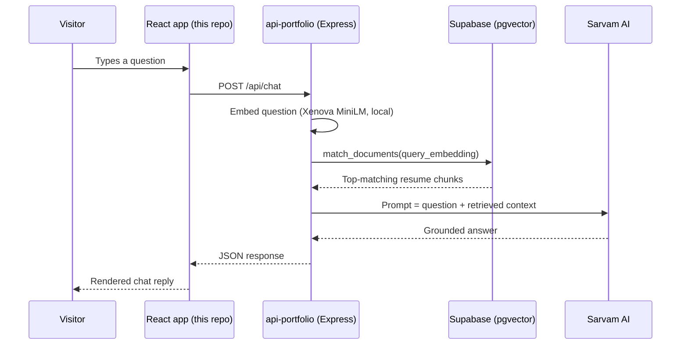

# Mounika Murugonda — AI-Powered Portfolio (Frontend)

Personal portfolio of **Mounika Murugonda**, Senior Frontend Engineer (React · Angular · UI/UX · AI · Micro-Frontends · 13+ years).

Live site: **[mounikamurugonda.vercel.app](https://mounikamurugonda.vercel.app)**

This repository contains the **frontend** (React + Vite). The AI chatbot backend (RAG API) lives in a separate repository: [`api-portfolio`](https://github.com/mounikamurugonda/api-portfolio).

---

## ✨ Features

- **AI Twin chatbot** — a RAG-powered assistant that answers questions about Mounika's experience, backed by Supabase pgvector + Sarvam AI.
- **Interactive experience timeline** — grouped engagements with expandable client projects.
- **Design-system-driven UI** — glassmorphism cards, duotone Phosphor icons, Framer Motion animations, Lenis smooth scrolling.
- **Contact form** — stores submissions in Supabase and triggers an email notification via Resend.
- **Light/dark ink-and-paper theme** with WCAG-conscious contrast.

## 🧱 Tech Stack

| Layer | Technology |
|---|---|
| Framework | React 18, TypeScript, Vite |
| Styling | Tailwind CSS 4, custom glassmorphism design system |
| Animation | Framer Motion, Lenis (smooth scroll) |
| Icons | Phosphor Icons (duotone) |
| Data / AI | Supabase (contacts), RAG API (separate repo) |
| Hosting | Vercel |

## 🗺️ System Architecture



## 📂 Project Structure

```text
portfolio/
├── apps/
│   └── web/                  # React + Vite frontend
│       ├── index.html        # Entry HTML (SEO meta, fonts, analytics)
│       └── src/
│           ├── components/
│           │   ├── layout/   # Navbar, ScrollProgress, FloatingActions
│           │   ├── sections/ # Hero, Skills, Experience, Projects,
│           │   │             # Education, Chatbot, Hobbies, Contact
│           │   └── ui/       # GlassCard, NeonButton, SectionWrapper, ...
│           ├── hooks/        # useLenis (smooth scroll)
│           └── lib/          # animations, api client, supabase client
├── supabase/
│   └── migrations/           # SQL schema (contacts + documents/pgvector)
└── package.json              # npm workspaces orchestration
```

## 🛠️ Prerequisites

- **Node.js** v18+ (v22 recommended)
- A **Supabase** project (for the contact form; the same project also backs the RAG API)
- The [`api-portfolio`](https://github.com/mounikamurugonda/api-portfolio) backend running locally or deployed (for the chatbot)

## 🚀 Getting Started

### 1. Clone and install

```bash
git clone https://github.com/mounikamurugonda/portfolio.git
cd portfolio
npm install
```

### 2. Configure environment variables

Create `apps/web/.env` (see `apps/web/.env.example`):

```env
# Backend API URL (local api-portfolio server)
VITE_API_URL=http://localhost:3000/api

# Supabase (contact form)
VITE_SUPABASE_URL=https://your-project.supabase.co
VITE_SUPABASE_ANON_KEY=your_anon_public_key
```

> Only the **anon public** key belongs in the frontend. Never put the service-role key in a `VITE_` variable — anything prefixed `VITE_` is bundled into public JavaScript.

### 3. Set up Supabase (one-time)

1. Create a project at [database.new](https://database.new).
2. Enable the `vector` extension (Database → Extensions).
3. Run the SQL in [`supabase/migrations/20240101000000_init.sql`](supabase/migrations/20240101000000_init.sql) in the SQL Editor. It creates:
   - `contacts` — contact-form submissions (RLS enabled; written via the backend service key only)
   - `documents` — pgvector store (384-dim embeddings for `all-MiniLM-L6-v2`)
   - `match_documents()` — the similarity-search function used by LangChain

### 4. Run the dev server

```bash
npm run dev
```

The site runs at **http://localhost:5173**. For a working chatbot, also start the backend from the `api-portfolio` repo (`npm run dev`, port 3000).

## 🤖 How the AI chatbot works



The knowledge base is seeded from `scripts/seed-data.ts` in the `api-portfolio` repo — see its README for how to re-ingest after a resume update.

## 📦 Build & Deployment

```bash
npm run build     # type-checks and builds apps/web → apps/web/dist
npm run lint      # ESLint over the web app
```

- **Frontend:** deploy `apps/web` to Vercel (framework preset: Vite). Set `VITE_API_URL`, `VITE_SUPABASE_URL`, and `VITE_SUPABASE_ANON_KEY` in the Vercel project settings.
- **Backend:** deployed separately from the `api-portfolio` repo.

## 🛡️ Security notes

- This repo is safe to keep **private or public**: no secrets are committed.
- `.gitignore` excludes `.env*`, build artifacts (`dist/`, `node_modules/`), and raw resume files (`*.pdf`, `*.docx`).
- The Supabase **service-role key exists only in the backend repo's environment**, never here.

---
Built with ❤️ by Mounika Murugonda
